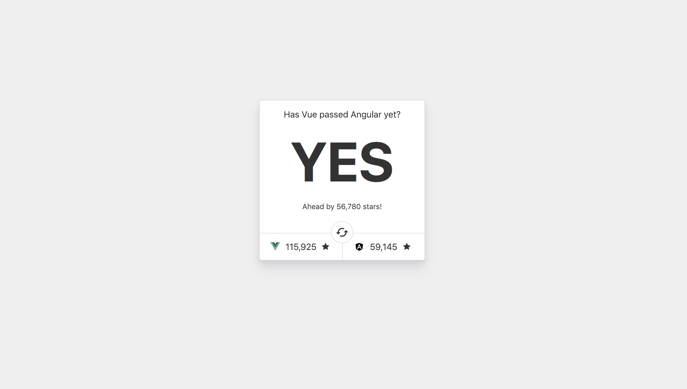

# Has Vue passed Angular yet? [](https://travis-ci.org/nicholasadamou/hasvuepassedangularyet)

> Just a fun little site to compare GitHub stars of Vue and Angular



### ⚠️ Setting up [WebTasks](https://webtask.io) (Required)

In order to make the asynchronous calls to the [Github API](https://developer.github.com/v4/), we must set up a server-less end-point that we can use to fetch information against GitHub's API (e.g. [`functions/fetchGithubStars.js`](functions/fetchGithubStars.js)).

To install the dependencies necessary to use WebTask's cli, run the following:

```bash
yarn wt:install
```

This function will install `axios` and the `wt-cli` which we need in order to make calls to GitHub's end-point.

However, we need to add our GitHub Personal Access Token to the `fetchGithubStars` web-task. To do this, run the following:

```bash
cd functions/
wt edit
```

This will open the WebTasks Dashboard. Click on the `fetchGithubStars` module in the explorer, then click on the wrench in the upper-left-hand-corner of the editor and select `secrets`. Click `Add Secret` and enter the following information being sure to type the _key_ value correctly:

```text
Key: GITHUB_TOKEN_1
Value: <Your-Github-Personal-Access-Token>
```

To learn more about adding secrets to a WebTask module, read [here](https://webtask.io/docs/editor/secrets).

### Getting Started

To run this locally, clone the repository and use Yarn or NPM to install the dependencies (You’ll need Node.js installed).

```bash
git clone https://github.com/nicholasadamou/hasvuepassedangularyet.git
cd hasvuepassedangularyet
yarn install
```

### Development

Start a dev server on [http://localhost:8080](http://localhost:8080)

```bash
yarn dev
```

### Production

To build for prod, run the following:

```bash
yarn build
```
